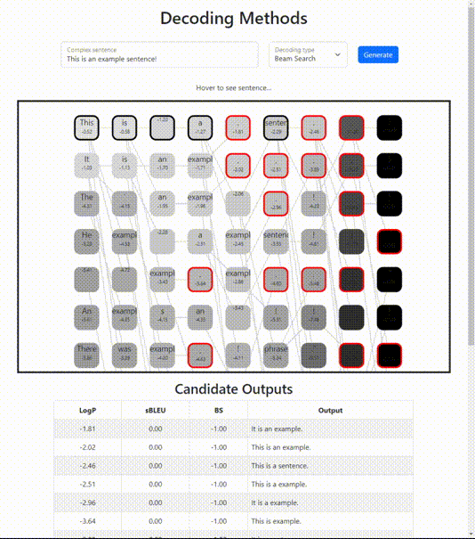

# Decoding Algos Visualizer
Vizualize beam-search or sampling of *any* Huggingface model! You can see model likelihoods of beam hypotheses, as well as their relative BERTScore (useful for MBR decoding, etc.)

~~Checkout a live demo **[here]()** (Note: this only has examples)~~ <- Coming soon!



**Note**: This is not secure or ready for production (i.e. many queries at the same time). This is meant for running locally.

## How to use
This repo is split into a **Python backend** to interact with the Huggingface API and a **React front-end** to serve the results.

Setup:
```
conda create -n decoding-vizualizer python=3.8
conda install -n decoding-vizualizer pip
conda activate decoding-vizualizer
pip install -r requirements.txt
```

Huggingface won't return the likelihood or hypothesis information we *need* to vizualize. So you need to directly modify your installation of transformers. I'm still trying to figure out the best way to put this in the github, but for now you can copy the `beam_search` function from `utils.py` into `transformers/src/transformers/generation/utils.py`. The *only* difference is the `beam_seq_scores` which returns scores of all beam hypotheses.

Specify the [model](https://huggingface.co/models) in `backend/server.py`. By default it will install and use `google/mt5-base`.

Start the front-end vizualizer:
```
cd viz
npm run start
```

Start the back-end server:
```
cd backend
python server.py
```

Navigate to `localhost:3000` and start vizualizing!
